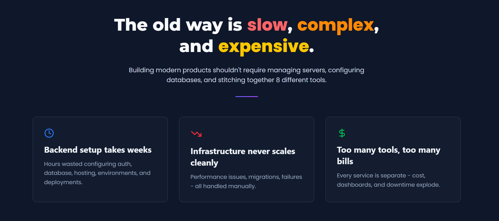
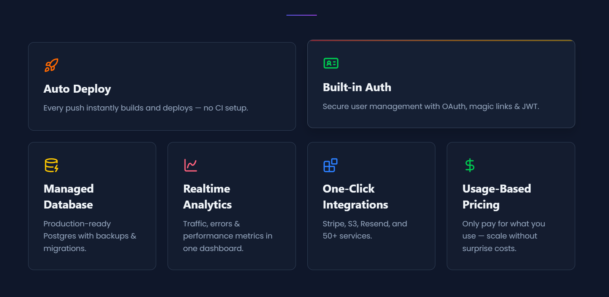
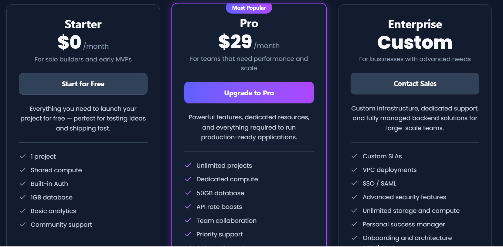

# DeployForge – Modern SaaS Landing Page (React + Tailwind)

DeployForge is a fully responsive, production-grade SaaS landing page built with React and TailwindCSS.  
It is designed to look like a real startup website (inspired by Linear, Vercel, and Supabase) and showcases clean UI, reusable components, modern animations using Framer Motion, and professional frontend practices.  
Perfect for portfolios, client work, and freelance platforms.

---

## Preview








---

## Features

- Fully responsive layout across all screen sizes
- Modern dark-theme SaaS interface
- Reusable and modular React components
- TailwindCSS utility-first styling
- Smooth hover and transition effects
- Framer Motion animations for section reveals, card motion, and interactive UI elements
- Clean and scalable folder structure

---

## Sections Included

DeployForge includes the core sections of a professional SaaS landing page:

- Navbar
- Hero Section
- Problem Section
- How It Works (3-step process)
- Features Grid
- Pricing Section
- Final Call-To-Action
- Footer

All sections are built with consistent spacing, responsive behavior, and animation-ready structure.

---

## Tech Stack

- React (Vite)
- TailwindCSS
- Framer Motion
- Lucide Icons
- Deployment: Netlify

---

## Installation & Setup

```bash
# Clone the project
git clone https://github.com/Anurag2516/deployforge-landing

# Navigate to project folder
cd deployforge-landing

# Install dependencies
npm install

# Start development server
npm run dev
```

---

## Contributing

Contributions, improvements, and suggestions are welcome.  
Feel free to open an issue or submit a pull request.

---

## Support

If you find this project helpful, consider starring the repository on GitHub.
